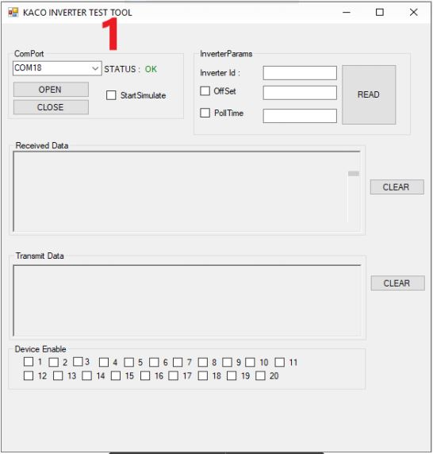

# KacoInverterTest-ReadTool

With this program you can do two things. One of them can read kaco branded inverters with rs485. 
Another is that you can test your code through this program.

- If you want to read multiple inverters together, enter the offset value after you have activated the offset tease. Then it will start reading at 750ms intervals.

- If you want to use the program for testing purposes, activate the start simulate. The program will start printing fake data in the correct format, according to the incoming query request.

- Creates a file named LogFile.txt in the file path where the program is running. Incoming data is logged in this file.

    

     

Contact me for any bug -> vvolkanunal@gmail.com
